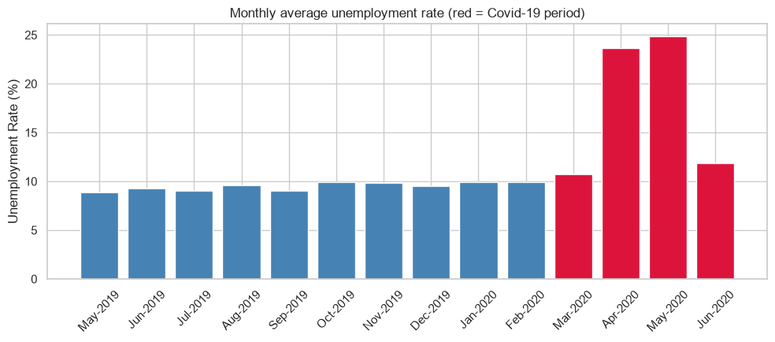

# 📉 Unemployment Analysis: India and Covid-19

An exploratory analysis of India's unemployment rate from May 2019 to November 2020 that quantifies the impact of the Covid-19 lockdown and breaks it down by rural vs urban areas, states and zones.

Completed as part of the **CodeAlpha Data Science Internship**. *(Task 2)*



## 📊 Key findings

- **Sharp Covid-19 shock:** the average unemployment rate rose from **9.51%** before the lockdown to **17.77%** during the March–June 2020 peak, an increase of **8.26 percentage points** (87% higher, nearly double).
- **Urban areas were hit harder than rural ones:** urban informal and service jobs were more exposed to mobility restrictions than agriculture-linked rural work.
- **Large regional disparity:** a handful of states spiked far above the national average, so state-targeted relief would be more efficient than a uniform national policy.
- **Recovery:** unemployment fell back toward the baseline by mid-to-late 2020 as labour participation recovered, which points to a lockdown-driven shock rather than a structural one.

## 🔬 Approach

1. **Clean:** drop empty rows, strip whitespace from column names, and parse dates in both datasets.
2. **National trend:** monthly average unemployment with the lockdown period highlighted.
3. **Covid impact:** compare pre-lockdown and lockdown-period averages.
4. **Rural vs urban:** unemployment trends by area.
5. **Regional:** average unemployment by state during the Covid period.
6. **Zones:** trends by geographic zone (Jan–Oct 2020).
7. **Labour participation:** unemployment against labour force participation as a recovery signal.
8. **Policy insights:** a summary of the findings.

## 📁 Dataset

Source: [Kaggle: gokulrajkmv/unemployment-in-india](https://www.kaggle.com/datasets/gokulrajkmv/unemployment-in-india)

| File | Covers |
|---|---|
| `data/Unemployment in India.csv` | May 2019 – Jun 2020 by state and area (rural/urban): 740 rows after cleaning |
| `data/Unemployment_Rate_upto_11_2020.csv` | Jan – Oct 2020 by state and zone, with coordinates: 267 rows |

Both come from the Centre for Monitoring Indian Economy (CMIE) and include the estimated unemployment rate, number employed and labour participation rate.

## 🚀 Run it

```bash
git clone https://github.com/salahuddinselim/CodeAlpha_Unemployment_Analysis.git
cd CodeAlpha_Unemployment_Analysis
python -m venv .venv
source .venv/bin/activate        # Windows: .venv\Scripts\activate
pip install -r requirements.txt
jupyter notebook unemployment_analysis.ipynb
```

Run the cells top to bottom (**Kernel → Restart & Run All**).

## 👤 Author

**Salah Uddin Selim** · [Portfolio](https://salah-uddin-selim.vercel.app) · [GitHub](https://github.com/salahuddinselim)
